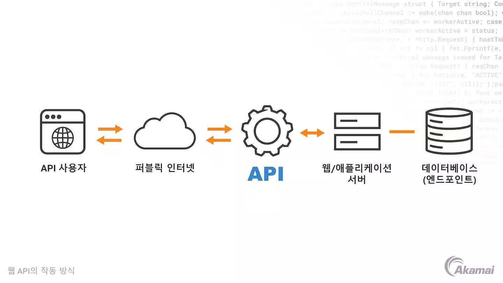
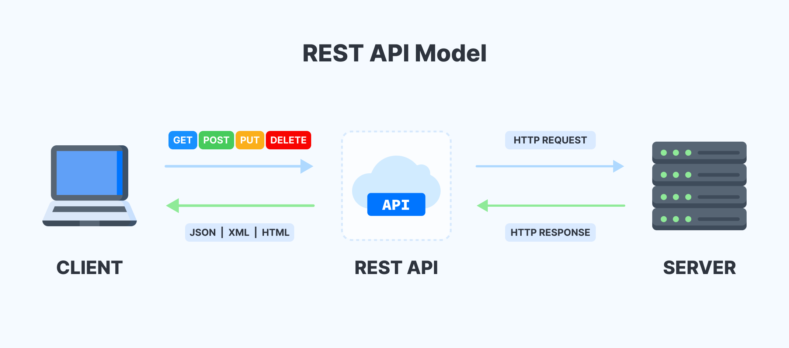

# API

#### 1. API의 개념

- **API**는 Application Programming Interface의 약자
- 정의 및 프로토콜 집합을 사용하여 두 소프트웨어 구성 요소가 서로 통신할 수 있게 함
  

#### 2. API의 종류

###### REST API

- 오늘날 웹에서 가장 많이 사용하는 유연한 API
- GET, POST, PUT, DELETE, PATCH는 모두 CRUD에 매칭됨

| CRUD      | 메소드     |
| --------- | ---------- |
| C(Create) | POST       |
| R(Read)   | GET        |
| U(Update) | PUT, PATCH |
| D(Delete) | DELETE     |

- 예시: 사용자 기능 RESTAPI

- GET /user/{user_primary_key} = 사용자 프로필 조회

      - POST /user = 사용자 생성(회원가입)
      - PUT /user/{user_primary_key} = user_primary_key의 유저를 새로운 유저로 대체
      - PATCH /user/{user_primary_key} = user_primary_key의 유저 정보를 수정
      - DELETE /user/{user_primary_key} = user_primary_key 유저를 삭제

###### SOAP API

- 객체 접근 프로토콜을 사용
- XML을 사용하여 메시지를 교환
- 과거에는 많이 사용하였지만, 유연성이 떨어져 요즘은 사용하지 않음

###### RPC API

- 원격 프로시저 호출이라고도 부름
- 클라이언트가 서버에서 함수나 프로시저를 완료하면 서버가 출력을 클라이언트로 전송

###### Websocket API

- JSON 객체를 사용하여 데이터를 전달하는 또 다른 최신 웹 API 개발
- 클라이언트 앱과 서버 간의 양방향 통신을 지원
- 서버가 연결된 클라이언트에 콜백 메시지를 전송할 수 있어 REST API보다 효율적
