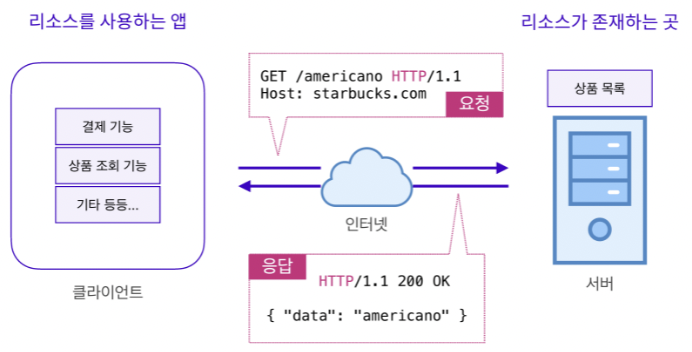

# 클라이언트 - 서버 구조

---

#### 1. 클라이언트와 서버의 개념

###### 클라이언트

- **클라이언트**는 요청을 보내는 주체를 의미하며, 고객 또는 의뢰인에 비유됨.
- 서버에게 필요한 자원을 요청하는 역할.
- **예시**: 카페에서 음료를 주문하는 손님.

###### 서버

- **서버**는 클라이언트에게 네트워크를 통해 정보나 서비스를 제공하는 컴퓨터 시스템.
- **예시**: 카페에서 음료 주문을 받고, 음료를 제작 후 제공하는 바리스타 = 서버.

---

#### 2. 클라이언트 - 서버의 흐름



- 클라이언트와 서버는 다음과 같은 흐름으로 리소스(데이터)를 교환

      <div style="text-align: center;">
      ```mermaid
        graph TD
        A(클라이언트 요청) --> B(서버 요청 수신)
        B(서버 요청 수신) --> C(서버 처리)
        C(서버 처리) --> D(서버 응답)
        D(서버 응답) --> E(리소스 활용)
        E(리소스 활용)
      ```
      </div>

---

#### 3. 클라이언트와 서버 존재 이유

> 클라이언트와 서버는 분리되는 것이 일반적 <br />
> 중요한 데이터 정보가 소스코드에 담겨 있다면, 소스코드를 읽는 것만으로 정보 조회 가능 <br /> > **예시** 코카콜라가 편의점에서 생성하여 제공한다면, 생성 과정을 볼 수 있어 레시피 유추 가능

---

#### 4.CORS 정책

###### CORS의 의미

- **CORS(Cross Origin Resource Sharing)** 정책은 출처가 다른 클라이언트로부터 데이터를 공유하지 않음을 규정.

###### 해결 방법

- CORS 정책은 서버의 Middleware에서 `Access-Control-Allow-Origin` 헤더를 설정하여 관리 가능.
- `Access-Control-Allow-Origin` 헤더가 `*`로 설정되면, 모든 IP(출처)로부터 데이터를 공유할 수 있음.
  

###### 예시

- 위 그림에서 Origin은 https://myshop.com:8080
- CORS 정책에 따르면, https://myshop2.com:8080은 https://myshop.com:8080으로 요청을 보낸다면, 요청을 거부
