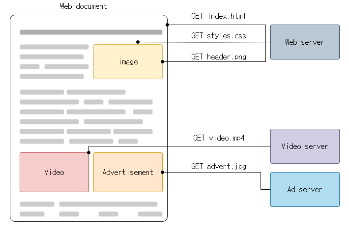
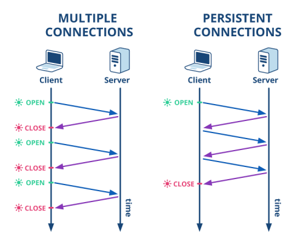
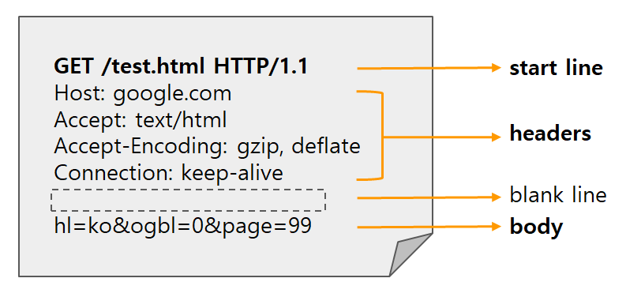

# HTTP

---

#### 1. 프로토콜

###### 프로토콜

- 프로토콜은 컴퓨터나 전자 기기 간에 데이터를 교환할 때 지켜야 하는 규칙 체계
- 예시: 한국에서 대화를 할 때는 한국어라는 언어를 사용해야 함

###### HTTP

- HTTP는 `HyperText Transfer Protocol`의 약자로, HTML과 같은 HyperText를 교환할 때 사용하는 프로토콜

---

#### 2. HTTP의 특징

###### 비연결성

- 처음 연결을 맺은 후 요청(request)과 한 번의 응답(response) 이후 연결이 종료됨
- 매번 연결을 맺어 느려지는 것을 보완하기 위해 `Keep-Alive`와 같은 속성을 활용

###### 무상태성

- 프로토콜에서 클라이언트의 상태를 기억하지 않음
- 클라이언트의 상태를 보관하기 위해 쿠키, 세션, JWT 토큰 등을 이용
- 예시: 회사 건물(서버)에 들어가기 위해선 출입증(JWT 토큰)이 필요함

---

#### 3. HTTP 구조

- HTTP 요청 메세지는 다음과 같이 구성됨:

      - **start-line**
      - **header**
      - **empty-line**
      - **body**

###### Header

- 요청에서 필요한 다양한 요소를 담는 공간
- 대표적인 Header 필드

      - `Content-Type`: Body의 데이터 타입을 지정
          - `application/json`: json
          - `multipart/form-data`: image or file
          - `application/x-www-form-urlencoded`: form data
          - `plain/text`: text

      - `Connection`: 주로 `keep-alive` 속성을 사용
      - `User-Agent`: 사용자의 기기를 식별
      - `Authorization`: 사용자 인증 정보를 담음
      - `Cookie`: 브라우저에 저장된 정보를 서버에 전달

###### Body

- Header의 `Content-Type`과 반드시 일치하는 데이터 형식을 사용
- `GET`과 `DELETE` 메소드는 Body를 사용하지 않음

---

#### 4. HTTP 메소드

###### GET

- 리소스를 읽거나 검색할 때 사용
- 멱등성을 지님
- 데이터를 쿼리스트링(Query String)으로 전달

      - `쿼리스트링`은 URL의 뒤에 입력 데이터를 함께 제공하는 가장 단순한 데이터 전달 방법
      - 예시: `https://blog.com?key=value&key2=value2` = blog.com 사이트에 `{key: value, key2: value}`라는 데이터를 전송

- 성공 시 `200 OK`, 실패 시 `404 Not Found` 또는 `400 Bad Request`

###### POST

- 리소스를 생성할 때 사용
- 멱등성을 지니지 않음
- 데이터를 Body로 전달
- 성공 시 `201 Created`, 실패 시 `401 Unauthorized`

###### PUT

- 리소스를 대체할 때 사용
- 멱등성을 지님
- 성공 시 `200 OK`, 실패 시 `401 Unauthorized`

###### PATCH

- 리소스를 부분 변경할 때 사용
- 멱등성을 지니지 않음
- 성공 시 `200 OK`, 실패 시 `401 Unauthorized`

###### DELETE

- 리소스를 삭제할 때 사용
- 멱등성을 지님
- 성공 시 `200 OK`, 실패 시 `401 Unauthorized`

---

#### 5. HTTP 상태 코드

###### 1xx (정보 제공)

- `100 Continue`: 요청의 일부를 수신했으며, 나머지를 계속하라는 의미

###### 2xx (성공)

- `200 OK`: 요청이 성공적으로 처리됨
- `201 Created`: 새로운 리소스가 생성됨
- `204 No Content`: 요청이 성공했으나 반환할 내용이 없음

###### 3xx (리다이렉션)

- `301 Moved Permanently`: 리소스가 영구적으로 이동됨
- `302 Found`: 요청한 리소스가 임시로 이동됨
- `307 Temporary Redirect`: 임시 리다이렉션

###### 4xx (클라이언트 에러)

- `400 Bad Request`: 요청이 잘못됨
- `401 Unauthorized`: 인증이 필요함
- `403 Forbidden`: 접근이 금지됨
- `404 Not Found`: 리소스를 찾을 수 없음

###### 5xx (서버 에러)

- `500 Internal Server Error`: 서버에서 에러가 발생함
- `502 Bad Gateway`: 잘못된 응답을 수신함
