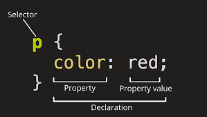
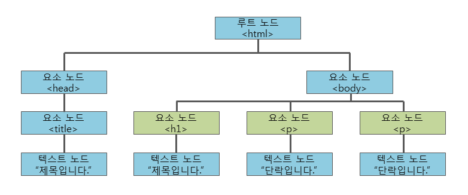

# 02. CSS

---

<link rel="stylesheet" href="https://cdnjs.cloudflare.com/ajax/libs/codemirror/5.65.13/codemirror.min.css">
<link rel="stylesheet" href="https://cdnjs.cloudflare.com/ajax/libs/codemirror/5.65.13/theme/material.min.css">

#### 1. CSS 개요

- **CSS**란 Cascading Style Sheets의 약자
- HTML 요소들이 각종 미디어에서 어떻게 보이는가를 정의하는데 사용되는 스타일 시트 언어
  
  CSS 코드

###### 인라인 스타일

- HTML 요소 내부에 style 속성을 사용하여 CSS 스타일을 적용하는 방법

CSS 파일
<textarea class="css-code" placeholder="Enter CSS source"></textarea>

HTML 파일

<textarea class="html-code" placeholder="Enter HTML Source Code">
<h2 style="color: green; text-decoration: underline">
  인라인 스타일을 이용하여 스타일을 적용하였습니다.
</h2>
</textarea>
  <button class="btn">실행</button>
<iframe class="frame"></iframe>

###### 내부 스타일 시트

- HTML 요소 내부에 style 속성을 사용하여 CSS 스타일을 적용하는 방법

CSS 파일
<textarea class="css-code" placeholder="Enter CSS source"></textarea>

HTML 파일

<textarea class="html-code" placeholder="Enter HTML Source Code">

<body>
  <h2>내부 스타일 시트를 이용하여 스타일을 적용하였습니다.</h2>
</body>
</textarea>
  <button class="btn">실행</button>
<iframe class="frame"></iframe>

###### 외부 스타일 시트

- .css 확장자를 사용하여 HTML 파일 외부에서 CSS 스타일을 적용하는 방법

CSS 파일

<textarea class="css-code" placeholder="Enter CSS source">
/* style.css */
body {
    background-color: lightyellow;
}
p {
    color: red;
    text-decoration: underline;
}
</textarea>

HTML 파일

<textarea class="html-code" placeholder="Enter HTML Source Code">
<head>
  <link rel="stylesheet" href="./style.css" />
</head>
<body>
  
외부 스타일 시트를 이용하여 스타일을 적용하였습니다.

</body>
</textarea>
  <button class="btn">실행</button>
<iframe class="frame"></iframe>

#### 2. CSS 기본 속성

###### 색(color)

- color 속성은 텍스트의 색상을 정의할 때 사용

CSS 파일

<textarea class="css-code" placeholder="Enter CSS source">
h1 {
  color: rgb(255, 0, 0);
}
ol {
  color: rgb(0, 255, 0);
}
</textarea>

HTML 파일

<textarea class="html-code" placeholder="Enter HTML Source Code">
<h1>Color 속성을 사용하여 텍스트의 색상을 변경하였습니다.</h1>

Color 속성을 적용하는 방법은 크게 3가지가 있습니다.

<ol>
  <li>색상 이름으로 표현</li>
  <li>RGB 색상값으로 표현</li>
  <li>16진수 색상값으로 표현</li>
</ol>
</textarea>
  <button class="btn">실행</button>
<iframe class="frame"></iframe>

###### 배경(background)

- background 속성은 태그의 배경을 정의할 때 사용
- background-color 속성

      - HTML 요소의 배경색을 설정

CSS 파일

<textarea class="css-code" placeholder="Enter CSS source">
body {
  background-color: lightblue;
}
h1 {
  background-color: rgb(255,128,0);
}
p {
  background-color: rgb(255, 255, 196);
}
</textarea>

HTML 파일

<textarea class="html-code" placeholder="Enter HTML Source Code">
<body>
  <h1>Background를 통해 배경색을 변경하였습니다!</h1>
  
정말 엄청나지 않나요?

</body>
</textarea>
  <button class="btn">실행</button>
<iframe class="frame"></iframe>

- background-image 속성

      - HTML 요소의 배경 이미지를 설정

CSS 파일

<textarea class="css-code" placeholder="Enter CSS source">
body {
  background-image: url('../../images/ghost.png');
  background-size: 10%;
}
</textarea>

HTML 파일

<textarea class="html-code" placeholder="Enter HTML Source Code">

</textarea>
  <button class="btn">실행</button>
<iframe class="frame"></iframe>

- background-repeat 속성

      - HTML 요소의 배경 반복 방향을 설정
      - 수직 방향(repeat-y), 수평 방향(repeat-x), 반복 안함(no-repeat)

CSS 파일

<textarea class="css-code" placeholder="Enter CSS source">
body {
  background-image: url('../../images/ghost.png');
  background-size: 10%;
  background-repeat: repeat-x;
}
</textarea>

HTML 파일

<textarea class="html-code" placeholder="Enter HTML Source Code">

</textarea>
  <button class="btn">실행</button>
<iframe class="frame"></iframe>

- background-position 속성

      - HTML 요소의 배경 위치를 설정
      - 배경 이미지의 상대 위치를 설정
      - 픽셀 또는 키워드 단위로 지정 (top, bottom, right, left, center)

<textarea class="css-code" placeholder="Enter CSS source">
body {
  background-image: url('../../images/ghost.png');
  background-size: 20%;
  background-repeat: no-repeat;
  background-position: top right;
}
</textarea>

HTML 파일

<textarea class="html-code" placeholder="Enter HTML Source Code">

</textarea>
  <button class="btn">실행</button>
<iframe class="frame"></iframe>

###### 텍스트(text)

- text속성은 텍스트에 스타일을 적용할 때 사용

- text-align 속성

      - 텍스트의 수평 방향 정렬을 설정

CSS 파일

<textarea class="css-code" placeholder="Enter CSS source">
h2 {
  text-align: center;
}
</textarea>

HTML 파일

<textarea class="html-code" placeholder="Enter HTML Source Code">
<h2>정렬된 텍스트 입니다. 깔끔하지 않나요?</h2>
</textarea>
  <button class="btn">실행</button>
<iframe class="frame"></iframe>

- text-decoration 속성

      - 텍스트에 여러가지 효과를 설정하거나 제거

CSS 파일

<textarea class="css-code" placeholder="Enter CSS source">
h2 {
  text-decoration: overline;
}
h3 {
  text-decoration: line-through;
}
h4 {
  text-decoration: underline;
}
a {
  text-decoration: none;
}
</textarea>

HTML 파일

<textarea class="html-code" placeholder="Enter HTML Source Code">
<h2>text-decoration 테스트</h2>
<h3>이 글은 읽기 힘듭니다.</h3>
<h4>이 글은 강조가 정말 잘되죠.</h4>
<a href="">원래 밑줄이 있어야 하는 a태그는 밑줄이 없습니다.</a>
</textarea>
  <button class="btn">실행</button>
<iframe class="frame"></iframe>

- font-size 속성

      - 텍스트의 크기를 조정
      - 절대적 크기(px), 상대적 크기(em ,rem)가 존재

CSS 파일

<textarea class="css-code" placeholder="Enter CSS source">
#large {
  font-size: 2.5em;
}
#small {
  font-size: 0.7em;
}
#fixed {
  font-size: 20px;
}
</textarea>

HTML 파일

<textarea class="html-code" placeholder="Enter HTML Source Code">

엄청 큰 텍스트

엄청 작은 텍스트

고정된 텍스트

</textarea>
  <button class="btn">실행</button>
<iframe class="frame"></iframe>

- font-family 속성

      - 하나의 글꼴만을 설정할 수도 있고, 여러 개의 글꼴을 같이 설정도 가능

CSS 파일

<textarea class="css-code" placeholder="Enter CSS source">
.serif { 
  font-family: "Times New Roman", Times, serif; 
}
.sansserif { 
  font-family: Arial, Helvetica, sans-serif; 
}
</textarea>

HTML 파일

<textarea class="html-code" placeholder="Enter HTML Source Code">
<h1>font-family 속성을 이용한 글꼴 설정</h1>

Times New Roman 글꼴을 적용합니다.

Arial 글꼴을 적용합니다.

</textarea>
  <button class="btn">실행</button>
<iframe class="frame"></iframe>

- font-weight 속성

      - 텍스트의 두께를 설정

CSS 파일

<textarea class="css-code" placeholder="Enter CSS source">
.normal { 
  font-weight: normal; 
}
.bold { 
  font-weight: 600; 
}
.bolder { 
  font-weight: bolder; 
}
</textarea>

HTML 파일

<textarea class="html-code" placeholder="Enter HTML Source Code">
<h1>font-weight 속성을 이용한 글꼴의 두께 설정</h1>

이 텍스트의 두께는 normal 스타일이 적용되어 있습니다.

이 텍스트의 두께는 600이 적용되어 있습니다.

이 텍스트의 두께는 bolder 스타일이 적용되어 있습니다.

</textarea>
  <button class="btn">실행</button>
<iframe class="frame"></iframe>

<h5 id="링크" style="font-style: bold">링크</h5>

- 링크는 총 5가지의 상태를 가지며, 각 상태마다 다른 스타일을 적용할 수 있음

| 링크    | 의미                                                                                          |
| ------- | --------------------------------------------------------------------------------------------- |
| link    | 링크의 기본 상태, 사용자가 아직 단 한번도 해당 링크를 통해 연결된 페이지를 방문하지 않은 상태 |
| visited | 사용자가 한 번이라도 해당 링크를 통해 연결된 페이지를 방문한 상태                             |
| hover   | 사용자의 마우스 커서가 링크 위에 올라가 있는 상태                                             |
| active  | 사용자가 마우스로 링크를 클릭하고 있는 상태                                                   |
| focus   | 키보드나 마우스의 이벤트 또는 다른 형태로 해당 요소가 포커스를 가지고 있는 상태               |

CSS 파일

<textarea class="css-code" placeholder="Enter CSS source">
a:link { color: olive; }
a:visited { color: brown; }
a:hover { color: coral; }
a:active { color: khaki; }
</textarea>

HTML 파일

<textarea class="html-code" placeholder="Enter HTML Source Code">
<h1>링크의 상태에 따른 스타일 설정</h1>

<a href="/index.php" target="_blank">홈으로 가기!</a>

</textarea>
  <button class="btn">실행</button>
<iframe class="frame"></iframe>

#### 3. CSS 박스 모델

###### 크기

- width와 height 속성

      - height와 width 속성은 HTML 요소의 높이와 너비를 설정
      - 기본 설정값은 auto, 웹 브라우저가 각 HTML 요소에 맞게 자동으로 높이와 너비를 설정
      - px과 달리 vw, vh를 통해 브라우저의 크기에 따라 상대적인 크기도 지정 가능

CSS 파일

<textarea class="css-code" placeholder="Enter CSS source">
div {
  width: 200px;
  height: 200px;
  border: 2px solid lightsalmon;
}
</textarea>

HTML 파일

<textarea class="html-code" placeholder="Enter HTML Source Code">
<h1>height와 width속성</h1>

이 div 요소의 높이는 200px이고 너비는 200px 입니다.

</textarea>
  <button class="btn">실행</button>
<iframe class="frame"></iframe>

- max-width 속성

      - HTML 요소가 가질 수 있는 최대 너비(width)를 설정
      - max-height는 최대 높이(height)를 설정

CSS 파일

<textarea class="css-code" placeholder="Enter CSS source">
div.width {
  width: 500px;
  border: 2px solid red;
}
div.maxWidth {
  max-width: 500px;
  border: 2px solid blue;
}
</textarea>

HTML 파일

<textarea class="html-code" placeholder="Enter HTML Source Code">

이 div는 width가 500px 고정입니다.
 

이 div는 브라우저의 가로 크기에 따라 최대 500px입니다.

</textarea>
  <button class="btn">실행</button>
<iframe class="frame"></iframe>

- min-width 속성

      - HTML 요소가 가질 수 있는 최소 너비(width)를 설정
      - min-height는 최소 높이(height)를 설정

CSS 파일

<textarea class="css-code" placeholder="Enter CSS source">
div.width {
  width: 500px;
  border: 2px solid #DAA520;
}
div.minWidth {
  min-width: 500px;
  border: 2px solid #CD5C5C;
}
</textarea>

HTML 파일

<textarea class="html-code" placeholder="Enter HTML Source Code">

이 div 요소는 width 속성을 500px로 설정했습니다.
 

이 div 요소는 min-width 속성을 500px로 설정했습니다.

</textarea>
  <button class="btn">실행</button>
<iframe class="frame"></iframe>

###### 박스 모델

- HTML 요소는 박스 모양으로 구성되며, 이것을 박스 모델이라 부름
- 박스 모델은 패딩(padding), 테두리(border), 마진(margin), 그리고 내용(content)으로 구분
  

| 용어           | 의미                                                 |
| -------------- | ---------------------------------------------------- |
| 내용(content)  | 텍스트나 이미지가 들어있는 박스의 실질적인 내용 부분 |
| 패딩(padding)  | 내용과 테두리 사이의 간격, 눈에 보이지 않음          |
| 테두리(border) | 내용과 패딩 주변을 감싸는 테두리                     |
| 마진(margin)   | 테두리와 이웃하는 요소 사이의 간격, 눈에 보이지 않음 |

CSS 파일

<textarea class="css-code" placeholder="Enter CSS source">
div.first {
  width: 195px;
  height: 195px;
  border: 5px solid red;
}
div.second {
  width: 95px;
  height: 195px;
  padding: 0px 50px;
  border: 5px solid blue;
}
div.third {
  width: 195;
  height: 195px;
  margin-top: 50px;
  border: 5px solid green;
}
</textarea>

HTML 파일

<textarea class="html-code" placeholder="Enter HTML Source Code">

이 div는 width 195 + border 5 = 가로 200px 입니다.

이 div는 width 95 + padding 100(좌우 50씩) + border 5 = 가로 200px입니다.

이 div는 width 195 + border 5 = 가로 200px 입니다. margin은 content에 영향을 주지 않습니다.  하지만, margin으로 인해 border 밖 부분에 50px의 공간이 생깁니다.

</textarea>
  <button class="btn">실행</button>
<iframe class="frame"></iframe>

#### 4. CSS 위치 속성

###### 디스플레이

- 웹 페이지의 레이아웃을 결정하는 CSS의 중요한 속성 중 하나
- HTML 요소가 웹 브라우저에 어떻게 보이는가를 결정

      - 블록(block)
      - 인라인(inline)

- 블록(block)

      - 블록인 요소는 언제나 새로운 라인에서 시작하며, 해당 라인의 모든 너비(width)를 차지
      - div, h1, p, ul, ol, form 요소는 대표적인 블록 요소

- 인라인(inline)

      - 인라인 요소는 새로운 라인에서 시작하지 않음
      - 요소의 너비(width)도 해당 라인 전체가 아닌 해당 HTML 요소의 내용(content)만큼 차지

CSS 파일

<textarea class="css-code" placeholder="Enter CSS source">
li {
  display: inline;
}
</textarea>

HTML 파일

<textarea class="html-code" placeholder="Enter HTML Source Code">
<ul class="circle">
  <li>HTML</li>
  <li>CSS</li>
  <li>JavaScript</li>
</ul>
</textarea>
  <button class="btn">실행</button>
<iframe class="frame"></iframe>

- 인라인 블록(inline-block)

      - 인라인-블록으로 설정된 요소들은 인라인 요소처럼 한 줄로 늘어서게 되며, 동시에 블록 요소처럼 너비와 높이를 설정할 수 있음

CSS 파일

<textarea class="css-code" placeholder="Enter CSS source">
div { 
  width: 100px; 
  height: 50px; 
}
.first { 
  background-color: aqua; 
}
.second { 
  background-color: green; 
}
.third { 
  background-color: yellow;
}
.inline { 
  display: inline; 
}
.inline-block { 
  display: inline-block; 
}
</textarea>

HTML 파일

<textarea class="html-code" placeholder="Enter HTML Source Code">

아래에 나오는 div 요소는 모두 display 속성값이 블록입니다.

블록

블록

블록
 

아래에 나오는 div 요소는 모두 display 속성값이 인라인입니다.

인라인

인라인

인라인
  

아래에 나오는 div 요소는 모두 display 속성값이 인라인-블록입니다.

인라인-블록

인라인-블록

인라인-블록

</textarea>
  <button class="btn">실행</button>
<iframe class="frame"></iframe>

###### 포지션

- HTML 요소가 위치를 결정하는 방식을 설정
- CSS에서 요소의 위치를 결정하는 방식은 4가지 방식이 있음

  | 포지션              | 의미                                                                                                                          |
  | ------------------- | ----------------------------------------------------------------------------------------------------------------------------- |
  | 정적(static) 위치   | 가장 기본적인 방식, 단순 웹 페이지의 흐름에 따라 차례대로 요소들을 위치시키는 방식                                            |
  | 상대(relative) 위치 | HTML 요소의 기본 위치를 기준으로 상대적인 위치를 지정하는 방식                                                                |
  | 고정(fixed) 위치    | 뷰포트(viewport)를 기준으로 위치를 설정하는 방식  웹 페이지가 스크롤 되어도 고정 위치로 지정된 요소는 항상 같은곳에 위치 |
  | 절대(absoltue) 위치 | 고정 위치와 비슷하지만, 뷰포트(viewport)를 기준으로 하는것이 아닌 위치가 설정된 조상(ancestor) 요소를 기준으로 위치를 설정    |

CSS 파일

<textarea class="css-code" placeholder="Enter CSS source">
div {
  border: 2px solid red;
  width: 90%;
  margin: 10px 0;
}
.static {
  position: static;
}
.relative {
  position: relative;
  left: 30px;
}
.fixed {
  position: fixed;
  width: 500px;
}
.absolute {
  position: absolute;
  border: 2px solid #006400 !important;
  width: 200px;
  height: 100px;
  right: 0;
  top: 100px;
}
.relative-box {
  width: 500px !important;
  height: 300px !important;
  position: relative;
  border: 2px solid #B8860B !important;
}
</textarea>

HTML 파일

<textarea class="html-code" placeholder="Enter HTML Source Code">

이 요소는 정적 위치 지정 방식으로 위치를 설정하였습니다.

이 요소는 상대 위치 지정 방식으로 위치를 설정한 후, left 속성값을 30px로 설정하였습니다.

이 요소는 상대 위치 지정 방식으로 위치를 설정하였습니다.
  
이 요소는 고정 위치 지정 방식으로 위치를 설정하였습니다. 스크롤을 내려도 위치가 고정됩니다!

  
이 요소는 절대 위치 지정 방식으로 위치를 설정한 후, top 속성값을 50px로 설정하였습니다.

이 요소는 절대 위치 지정 방식으로 위치를 설정한 후, top 속성값을 50px로 설정하였습니다.

절대 위치는 해당 요소의 바로 상위의 위치가 설정된 조상(ancestor) 요소에 따라 위치를 재조정하는 방식입니다!

</textarea>
  <button class="btn">실행</button>
<iframe class="frame"></iframe>

#### 5. 선택자

###### 선택자(selector)

- 스타일을 적용할 대상을 선택하기 위해 선택자를 사용
- 기본적인 선택자는 다음과 같음

| 선택자                | 의미                                                                     |
| --------------------- | ------------------------------------------------------------------------ |
| 전체 선택자(\*)       | CSS를 적용할 대상으로 HTML 문서 내부의 모든 요소를 선택                  |
| HTML 요소 선택자(tag) | CSS를 적용할 대상으로 HTML 요소의 이름을 직접 사용하여 선택              |
| 아이디 선택자(#)      | CSS를 적용할 대상으로 요소 중 특정 아이디 이름만 가지는 요소만을 선택    |
| 클래스 선택자(.)      | CSS 적용할 대상으로 요소 중 같은 클래스 이름을 가지는 요소들을 모두 선택 |
| 그룹 선택자(,)        | 여러 선택자를 같이 사용하고자 할 떄 사용                                 |

CSS 파일

<textarea class="css-code" placeholder="Enter CSS source">
* {
  color: red;
}
div {
  border: 2px solid blue;
}
#header {
  text-decoration: underline;
  font-size: 1.8em;
}
.item {
  text-decoration: line-through;
}
h2, h3 {
  text-align: center;
}
</textarea>

HTML 파일

<textarea class="html-code" placeholder="Enter HTML Source Code">
<h1 id="header">이 문서의 헤더 부분입니다.</h1>
<h2>h2 태그는 가운데 정렬입니다.</h2>
<h3>h3 태그또한 가운데 정렬입니다.</h3>
<ul>
  <li class="item">아이템 1</li>
  <li class="item">아이템 2</li>
  <li class="item">아이템 3</li>
</ul>

전체 선택자로 인해 모든 텍스트가 빨간색입니다!

</textarea>
  <button class="btn">실행</button>
<iframe class="frame"></iframe>

###### 결합 선택자

- 결합 선택자는 연관된 선택자들 간의 관계를 설정
- 관계는 크게 자손(descendant), 자식(child) 관계가 존재

- 자손 선택자

      - 하위 요소 중에서 특정 타입의 요소를 모두 선택
      - `E E1 {style code}` 와 같이 사용

- 자식 선택자

      - 바로 밑에 존재하는 하위 요소 중에서 특정 타입의 요소를 모두 선택
      - `E > E1 {style code}`와 같이 사용

CSS 파일

<textarea class="css-code" placeholder="Enter CSS source">
div p {
  border: 2px solid red;
}
ul > li {
  color: blue;
}
</textarea>

HTML 파일

<textarea class="html-code" placeholder="Enter HTML Source Code">

자손 선택자로 인해 div 외부의 p 태그는 선택되지 않습니다.

  
결합 선택자 예제 입니다!

  
div 내부의 p 태그는 선택되었습니다!

  <big>
div 내부의 big 내부의 p 태그 또한 선택되었습니다!
</big>

<ul>
  <li>아이템 1</li>
  <li>아이템 2</li>
  <ol>
    
자식 선택자로 인해 ul 내부의 ol 내부의 li는 선택되지 않습니다.

    <li>아이템 3</li>
    <li>아이템 4</li>
    <li>아이템 5</li>
  </ol>
</ul>
</textarea>
  <button class="btn">실행</button>
<iframe class="frame"></iframe>

###### 동위 선택자

- 동위 관계에 있는 요소 중에서 해당 요소보다 뒤에 존재하는 특정 타입의 요소를 모두 선택
- 아래 그림에서, 초록색으로 표시된 세 요소 모두 body 요소를 부모로 가짐

      - 따라서 이 세 요소는 동위 관계에 있는 `형제 요소`

  

- 일반 동위 선택자

      - 동위 관계이며, 해당 요소보다 뒤에 존재하는 특정 타입의 요소를 모두 선택
      - `E ~ E2 {style code}`와 같이 사용

- 인접 동위 선택자

      - 동위 관계이며, 해당 요소의 바로 뒤에 존재하는 특정 타입의 요소를 모두 선택

CSS 파일

<textarea class="css-code" placeholder="Enter CSS source">
div {
  border: 3px solid #F08080;
}
div ~ p {
  background-color: #FFE4E1;
}
div + p {
  color: blue;
}
</textarea>

HTML 파일

<textarea class="html-code" placeholder="Enter HTML Source Code">

  
div의 자식 태그 P태그

div 태그의 인접 동위 관계 이며, 일반 동위 관계

div태그의 일반 동위 관계

</textarea>
  <button class="btn">실행</button>
<iframe class="frame"></iframe>

###### 동적 의사 클래스

- 의사 클래스는 HTML 요소의 특별한 `상태(state)`를 명시할 때 사용
- 동적 의사 클래스는 <a href="#링크">링크</a>를 참고

###### 상태 의사 클래스

- 상태 의사 클래스는 입력 양식의 상태에 따라 각각의 스타일을 별도로 설정

| 클래스    | 의미                                               |
| --------- | -------------------------------------------------- |
| :checked  | input 요소 중에서 체크된 상태의 input 요소를 선택  |
| :enabled  | input 요소 중에서 사용할 수 있는 input 요소를 선택 |
| :disabled | input 요소 중에서 사용할 수 없는 input 요소를 선택 |

CSS 파일

<textarea class="css-code" placeholder="Enter CSS source">
span { 
  margin-left: 5px; 
}
input { 
  color: #FFEFD5; 
}
input:checked + span { 
  color: #CD853F; 
}
input:disabled + span { 
  color: #00FFFF;
}
</textarea>

HTML 파일

<textarea class="html-code" placeholder="Enter HTML Source Code">
<form>
  <input type="checkbox" name="lecture" value="html" checked="checked" />
  HTML 
  <input type="checkbox" name="lecture" value="css" />
  CSS 
  <input type="checkbox" name="lecture" value="java" />
  JAVA 
  <input type="checkbox" name="lecture" value="cpp" disabled="disabled" />
  C++
</form>
</textarea>
  <button class="btn">실행</button>
<iframe class="frame"></iframe>

###### 구조 의사 클래스

- HTML 요소의 계층 구조에서 특정 위치에 있는 요소를 선택

| 클래스             | 의미                                                                                                                                |
| ------------------ | ----------------------------------------------------------------------------------------------------------------------------------- |
| :first-child       | 모든 자식 요소중 맨 앞에 위치하는 자식 요소를 모두 선택                                                                             |
| :last-child        | 모든 자식 요소중 맨 뒤에 위치하는 자식 요소를 모두 선택                                                                             |
| :nth-child(n)      | 모든 자식 요소중 앞에서부터 n번째에 위치하는 자식(child) 요소를 모두 선택 2n -> 짝수, 2n + 1 -> 홀수 같은 방법으로도 사용 가능 |
| :nth-last-child(n) | 모든 자식 요소중 뒤에서부터 n번째에 위치하는 자식(child) 요소를 모두 선택                                                           |
| :first-of-type     | 모든 자식 요소중 맨 처음으로 등장하는 특정 타입의 요소를 모두 선택                                                                  |
| :last-of-type      | 모든 자식 요소중 맨 뒤에 등장하는 특정 타입의 요소를 모두 선택                                                                      |
| :nth-of-type       | 모든 자식 요소중 n번째로 등장하는 특정 타입의 요소를 모두 선택                                                                      |
| :nth-last-of-type  | 모든 자식 요소중 뒤에서부터 n번째로 등장하는 특정 타입의 요소를 모두 선택                                                           |
| :not(E)            | 해당 선택자를 반대로 적용하여 선택                                                                                                  |
| :empty             | 자식 요소를 전혀 가지고 있지 않은 요소를 모두 선택                                                                                  |
| :root              | 해당문서의 root 요소를 선택                                                                                                         |

CSS 파일

<textarea class="css-code" placeholder="Enter CSS source">
p:first-child, p:last-child {
  font-weight: bold;
}
p:first-child {
  color: red;
}
p:last-child {
  color: blue;
}
li:nth-child(2n) {
  text-decoration: underline;
}
li:nth-child(2n + 1) {
  background-color: #FF00FF;
}
li:empty {
  background-color: aqua;
}
:root {
  background-color: lightyellow;
}
</textarea>

HTML 파일

<textarea class="html-code" placeholder="Enter HTML Source Code">

첫 번째 단락입니다!

두 번째 단락입니다!

세 번째 단락입니다!

<ol>
  <li>첫 번째 아이템입니다!</li>
  <li>두 번째 아이템입니다!</li>
  <li>세 번째 아이템입니다!</li>
  <li>네 번째 아이템입니다!</li>
  <li></li>
</ol>
</textarea>
  <button class="btn">실행</button>
<iframe class="frame"></iframe>

- child와 of-type의 차이를 알고 싶다면, css 파일 7번째 줄의 `p:last-child`를 `p:last-of-type`으로 변경

###### 의사 요소

- 해당 HTML 요소의 특정 부분만을 선택할 때 사용
- `E::pseudo {style code}`와 같은 문법을 사용

| 의사 요소      | 의미                                             |
| -------------- | ------------------------------------------------ |
| ::after        | 특정 요소의 내용 부분 바로 뒤에 다른 요소를 삽입 |
| ::before       | 특정 요소의 내용 부분 바로 앞에 다른 요소를 삽입 |
| ::first-letter | 텍스트 요소의 첫 글자만을 선택                   |
| ::first-line   | 텍스트 요소의 첫 라인만을 선택                   |
| ::placeholder  | input 요소의 placeholder 부분을 선택             |

CSS 파일

<textarea class="css-code" placeholder="Enter CSS source">
p::first-letter {
  font-size: 2.4em;
}
p::first-line {
  color: orange;
}
</textarea>

HTML 파일

<textarea class="html-code" placeholder="Enter HTML Source Code">

Lorem ipsum dolor sit amet, consectetur adipiscing elit. Praesent at tellus et neque luctus tincidunt at vitae ligula. Donec a accumsan magna. Pellentesque habitant morbi tristique senectus et netus et malesuada fames ac turpis egestas. Sed dolor nunc, facilisis in felis efficitur, sodales maximus nunc. Integer congue lectus vitae velit aliquam vehicula. Nunc mauris massa, sodales vitae augue ut, pulvinar mollis erat. Sed feugiat, mauris vitae convallis iaculis, nibh magna pretium diam, a sagittis quam urna quis augue. Nam feugiat accumsan ante id porttitor. Morbi tempus accumsan sem vitae venenatis. Duis mattis consequat ipsum nec interdum. Curabitur placerat vulputate faucibus. Cras consectetur elit ut metus consectetur tristique.

</textarea>
  <button class="btn">실행</button>
<iframe class="frame"></iframe>

CSS 파일

<textarea class="css-code" placeholder="Enter CSS source">
p:before {
  content: '💻';
  width: 20px;
  height: 20px;
}
p:after {
  content: '❤️';
  width: 20px;
  height: 20px;
}
</textarea>

HTML 파일

<textarea class="html-code" placeholder="Enter HTML Source Code">

즐거운 코딩공부

</textarea>
  <button class="btn">실행</button>
<iframe class="frame"></iframe>

###### 속성 선택자

- 특정 속성이나 속성값을 가지고 있는 HTML 요소를 선택

| 선택자                 | 의미                                                                                  |
| ---------------------- | ------------------------------------------------------------------------------------- |
| E[속성이름]            | 특정 속성을 가지고 있는 요소E를 모두 선택                                             |
| E[속성이름="속성값"]   | 특정 속성의 값이 속성값과 정확히 일치하는 요소 E를 모두 선택                          |
| E[속성이름~="속성값"]  | 특정 속성의 속성값에 특정 문자열로 이루어진 하나의 단어를 포함하는 요소 E를 모두 선택 |
| E[속성이름\|="속성값"] | 특정 속성의 속성값이 특정 문자열로 이루어진 하나의 단어로 시작하는 요소 E를 모두 선택 |
| E[속성이름^="속성값"]  | 특정 속성의 속성값이 특정 문자열로 시작하는 요소 E를 모두 선택                        |
| E[속성이름$="속성값"]  | 특정 속성의 속성값이 특정 문자열로 끝나는 요소 E를 모두 선택                          |
| E[속성이름*="속성값"]  | 특정 속성의 속성값에 특정 문자열을 포함하는 요소 E를 모두 선택                        |

CSS 파일

<textarea class="css-code" placeholder="Enter CSS source">
p[title] {
  background-color: black;
  color: white;
}
p[title="super"] {
  text-decoration: underline;
}
p[title~="first"] {
  font-size: 1.8em; 
}
p[title|="first"] {
  color: #FF00FF;
}
</textarea>

HTML 파일

<textarea class="html-code" placeholder="Enter HTML Source Code">

이 단락은 title 속성은 "super"와 일치하지 않습니다.

이 단락은 title 속성은 "super"와 일치합니다.

이 단락은 title 속성값이 "first"와 "p"입니다.

이 단락은 title 속성값이 "first-p"입니다! first-p의 문자열이 first로 시작합니다.

이 단락은 title속성이 없습니다.

</textarea>
  <button class="btn">실행</button>
<iframe class="frame"></iframe>

CSS 파일

<textarea class="css-code" placeholder="Enter CSS source">
p[title^="first"] {
  background-color: black;
  color: white;
}
p[title$="first"] {
  background-color: orange;
}
p[title*="first"] {
  text-decoration: underline;
}
</textarea>

HTML 파일

<textarea class="html-code" placeholder="Enter HTML Source Code">

이 단락은 title 속성값이 "first p"입니다!

이 단락은 title 속성값이 "first-p"입니다!

이 단락은 title 속성값이 "p first"입니다!

이 단락은 title속성이 없습니다.

</textarea>
  <button class="btn">실행</button>
<iframe class="frame"></iframe>

#### 6. 고급 CSS

###### @규칙

- @규칙(at-rule)을 통해 몇몇 규칙들을 사용 가능

- `@import`

      - 다른 스타일 시트에서 규칙을 가져올 수 있는 규칙
      - @charset 규칙을 제외하고 모든 다른 규칙보다 앞서 명시되어야 함
      - 보통 HTML 문서에서 link 태그를 이용해 CSS 파일을 불러오는것 처럼, CSS에서는 `@import` 규칙을 사용해서 다른 CSS 파일을 불러옴
      - 예시: `@import url("awesomeCss.css")`

- `@font-face`

      - 웹 폰트를 정의할 때 사용하는 규칙
      - 사용자의 컴퓨터에 설치되어 있지 않은 글꼴(font)을 웹 브라우저가 사용할 수 있도록 함
      - 예시: `@font-face { font style code }`

- `@media`

      - 서로 다른 미디어 타입(media type)을 위한 맞춤식 스타일 시트를 지원
      - 예시: `@media screen and print { style code }`

###### @keyframes

- 특정한 시간에 해당 요소가 가져야할 CSS 스타일을 명시
- 해당 요소의 스타일은 특정 시간까지 현재 스타일에서 설정해 놓은 새로운 스타일로 천천히 변화

CSS 파일

<textarea class="css-code" placeholder="Enter CSS source">
div.from-to {
  border: 2px solid red;
  width: 300px;
  height: 200px;
}
div.from-to:hover {
  animation-name: hover-animation;
  animation-duration: 2s;
}
@keyframes hover-animation {
  from {
    width: 300px;
    height: 200px;
  }
  to {
    width: 500px;
    height: 300px;
  }
}
</textarea>

HTML 파일

<textarea class="html-code" placeholder="Enter HTML Source Code">

이 div는 from to 키워드를 이용하여 애니메이션을 생성

</textarea>
  <button class="btn">실행</button>
<iframe class="frame"></iframe>

###### transition 속성

- 해당 요소에 추가할 CSS 스타일 전환(transition)효과를 설정
- 추가할 전환 효과가 지속될 시간을 설정

CSS 파일

<textarea class="css-code" placeholder="Enter CSS source">
div.transition {
  border: 2px solid red;
  width: 300px;
  height: 200px;
  transition-property: width, height;
  transition-duration: 2s;
}
div.transition:hover {
  width: 500px;
  height: 300px;
}
</textarea>

HTML 파일

<textarea class="html-code" placeholder="Enter HTML Source Code">

이 div는 width와 height의 transition이 적용 되어있습니다.

</textarea>
  <button class="btn">실행</button>
<iframe class="frame"></iframe>

- `@keyframes`규칙과 `transition`속성은 매우 흡사
- `transition`속성은 CSS의 선택자에 의존, `@keyframes`는 비교적 자유로움(A버튼 클릭 -> B버튼 크기 변경 가능, 자바스크립트 내용)

###### transform 속성

- HTML 요소의 모양, 크기, 위치 등을 자유롭게 바꿀 수 있음
- transform은 크게 `2D` transform과 `3D` transform이 존재

- 2D transform

| 메소드      | 역할                                                           |
| ----------- | -------------------------------------------------------------- |
| translate() | 현재 위치에서 해당 요소를 주어진 x축과 y축의 거리만큼 이동     |
| rotate()    | 해당 요소를 주어진 각도만큼 시계 방향이나 반시계 방향으로 회전 |
| scale()     | 해당 요소의 크기를 주어진 배율만큼 늘리거나 줄임               |
| skewX()     | 해당 요소를 주어진 각도만큼 x축 방향으로 기울임                |
| skewY()     | 해당 요소를 주어진 각도만큼 y축 방향으로 기울임                |

CSS 파일

<textarea class="css-code" placeholder="Enter CSS source">
div {
  width: 100px;
  height: 50px;
  margin: 15px 0;
  border: 2px solid red;
  transition: transform 1s ease;
}
.translate:hover {
  transform: translate(100px, 50px);
}
.rotate:hover {
  transform: rotate(30deg);
}
.scale:hover {
  transform: scale(1.1);
}
.skewX:hover {
  transform: skewX(30deg);
}
.skewY:hover {
  transform: skewY(30deg);
}
</textarea>

HTML 파일

<textarea class="html-code" placeholder="Enter HTML Source Code">

translate 적용

rotate 적용

scale 적용

skewX 적용

skewY 적용

</textarea>
  <button class="btn">실행</button>
<iframe class="frame"></iframe>

- 3D transform

- HTML 요소의 모양, 크기, 위치 등을 입체적으로 변형시킬 수 있음

| 메소드        | 역할                                                                             |
| ------------- | -------------------------------------------------------------------------------- |
| rotateX()     | 해당 요소를 주어진 각도만큼 x축을 기준으로 회전시킴. rotateY(), rotateZ()도 같음 |
| translate3d() | 해당 요소를 주어진 x축, y축과 z축의 거리만큼 이동                                |
| translateX()  | 해당 요소를 주어진 x축의 거리만큼 이동시킴. translateY(), translateZ()도 같음    |
| scaleX()      | 해당 요소의 x축 크기를 주어진 배율만큼 늘리거나 줄임. scaleY(), scaleZ()도 같음  |

CSS 파일

<textarea class="css-code" placeholder="Enter CSS source">
div {
  width: 100px;
  height: 50px;
  margin: 15px 0;
  border: 2px solid red;
  transition: transform 1s ease;
}
div.rotateX:hover {
  transform: rotateX(180deg);
}
div.rotateY:hover {
  transform: rotateY(180deg);
}
div.rotateZ:hover {
  transform: rotateZ(180deg);
}
div.translate3d:hover {
  transform: translate3d(100px, 50px, 30px);
}
div.scaleX:hover {
  transform: scaleX(1.5);
}
div.scaleY:hover {
  transform: scaleY(1.5);
}
div.scaleZ:hover {
  transform: scaleZ(1.5);
}
</textarea>

HTML 파일

<textarea class="html-code" placeholder="Enter HTML Source Code">

rotateX

rotateY

rotateZ

translate3d

scaleX

scaleY

scaleZ

</textarea>
  <button class="btn">실행</button>
<iframe class="frame"></iframe>

###### 그래디언트

- HTML 요소에 그래디언트 효과를 적용시킴
- 선형 그래디언트와 원형 그래디언트가 존재

- 선형 그래디언트

CSS 파일

<textarea class="css-code" placeholder="Enter CSS source">
div {
  background: linear-gradient(orange, green);
  width: 300px;
  height: 200px;
}
</textarea>

HTML 파일

<textarea class="html-code" placeholder="Enter HTML Source Code">

선형 그래디언트

</textarea>
  <button class="btn">실행</button>
<iframe class="frame"></iframe>

- 원형 그래디언트

CSS 파일

<textarea class="css-code" placeholder="Enter CSS source">
div {
  background: radial-gradient (red, orange, ytellow, green, blue, indigo, purple);
}
</textarea>

HTML 파일

<textarea class="html-code" placeholder="Enter HTML Source Code">

원형 그래디언트

</textarea>
  <button class="btn">실행</button>
<iframe class="frame"></iframe>

###### 그림자 효과

- 그림자 효과는 text-shadow, box-shadow가 존재
- `shadow: x, y, blur, color`의 문법을 가짐

CSS 파일

<textarea class="css-code" placeholder="Enter CSS source">
h1 {
  text-shadow: 2px 2px 5px black;
}
div {
  border: 2px solid red;
  box-shadow: 5px 5px 5px red;
}
</textarea>

HTML 파일

<textarea class="html-code" placeholder="Enter HTML Source Code">

  <h1>텍스트 그림자</h1>

</textarea>
  <button class="btn">실행</button>
<iframe class="frame"></iframe>

#### 7. flex 디스플레이

###### 정의

- 뷰 포트나 요소의 크기가 불명확하거나 동적으로 변할 때에도 효율적으로 요소를 배치, 정렬, 분산 시킴
- 자식 요소인 flex-item과 부모 요소인 flex-container로 구성됨

CSS 파일

<textarea class="css-code" placeholder="Enter CSS source">
.container {
  display: flex;
  width: 500px;
  height: 300px;
  border: 1px solid black;
  flex-direction: column;
}
</textarea>

HTML 파일

<textarea class="html-code" placeholder="Enter HTML Source Code">

  아이템 1
  아이템 2
  아이템 3

<h1>뭔가 이상하지 않나요?</h1>

span은 인라인 요소인데 블록 요소 처럼 보입니다! flex-direction이 column이기에 세로로 정렬되었습니다

</textarea>
  <button class="btn">실행</button>
<iframe class="frame"></iframe>

###### 속성

| 속성            | 역할                                                                                                    |
| --------------- | ------------------------------------------------------------------------------------------------------- |
| flex-direction  | 플렉스 컨테이너 안에서 플렉스 요소가 배치될 방향을 설정  row, row-reverse, column, column-reverse  |
| justify-content | 플렉스 요소의 수평 방향 정렬 방식을 설정 flex-start, flex-end, center, space-between, space-around |
| align-items     | 플렉스 요소의 수직 방향 정렬 방식을 설정  stretch, flex-start, flex-end, center, baseline          |

CSS 코드

<textarea class="css-code" placeholder="Enter CSS source">
.flexbox {
  background-color: dimgray;
  width: 400px;
  height: 150px;
  border-radius: 15px;
  display: flex;
}
.flex-reverse{
  flex-direction: row-reverse;
}
.align-center {
  align-items: center;
}
.item {
  background-color: darkgray;
  border-radius: 10px;
  width: 80px;
  height: 50px;
  margin: 10px;
  color: white;
  font-size: 26px;
  text-align: center;
  line-height: 50px;
}
</textarea>

HTML 파일

<textarea class="html-code" placeholder="Enter HTML Source Code">

일반적인 flex (flex-direction: row)

  
1

  
2

  
3

반전된 flex (flex-direction: row-reverse)

  
1

  
2

  
3

좌측 정렬된 flex (align-items: center)

  
1

  
2

  
3

</textarea>
  <button class="btn">실행</button>
<iframe class="frame"></iframe>

###### 예시

CSS 파일

<textarea class="css-code" placeholder="Enter CSS source">
:root {
  background-color: #1F1F1F;
}
a {
  transition: color 0.5s ease;
  text-decoration: none;
  color: white;
  font-style: bold;
}
.nav-header {
  width: 100%;
  height: 30px;
  display: flex;
  justify-content: space-around;
  align-items: center;
  list-style-type: none;
}
.nav-item {
  display: block;
  width: 100%;
  height: 100%;
  transition: background 0.5s ease;
  cursor: pointer;
  text-align: center;
}
.nav-item:hover {
  background: white;
}
.nav-item:hover > a {
  color: black;
}
</textarea>

HTML 파일

<textarea class="html-code" placeholder="Enter HTML Source Code">
<nav class="nav-header">
  <li class="nav-item"><a href="#">링크 1</a></li>
  <li class="nav-item"><a href="#">링크 2</a></li>
  <li class="nav-item"><a href="#">링크 3</a></li>
  <li class="nav-item"><a href="#">링크 4</a></li>
</nav>
</textarea>
  <button class="btn">실행</button>
<iframe class="frame"></iframe>

#### 8. 미디어 쿼리(media query)

###### 정의

- @media 규칙을 적용할 때, 매체 유형(media type)과 하나 이상의 표현식(expression)으로 구성된 쿼리(media query)를 사용
- width, height, color 속성과 같은 미디어 관련 속성을 이용한 표현식을 통해 스타일이 적용되는 범위를 조절할 수 있음

###### 매체 유형

| 매체 유형 | 설명                                                           |
| --------- | -------------------------------------------------------------- |
| all       | 모든 매체에 사용                                               |
| print     | 프린터 기기에 사용                                             |
| screen    | 컴퓨터나 태블릿, 스마트폰 등 스크린(screen)이 있는 매체에 사용 |
| speech    | 웹 페이지를 읽어주는 스크린 리더에 사용                        |

###### 미디어 쿼리

| 속성               | 설명                             |
| ------------------ | -------------------------------- |
| width              | 화면의 너비                      |
| height             | 화면의 높이                      |
| device-width       | 매체 화면의 너비                 |
| device-height      | 매체 화면의 높이                 |
| devie-aspect-ratio | 매체 화면의 비율                 |
| orientation        | 매체 화면의 방향                 |
| color              | 매체의 색상 비트 수              |
| color-index        | 매체에서 표현 가능한 색상의 개수 |
| monochrome         | 흑백 매체에서의 픽셀당 비트 수   |
| resolution         | 매체의 해상도                    |

###### 예제

CSS 파일

<textarea class="css-code" placeholder="Enter CSS source">
body {
  background-color: darkorange;
}
@media screen and (min-width: 480px) {
  body {
    background-color: lightblue;
  }
}
</textarea>

HTML 파일

<textarea class="html-code" placeholder="Enter HTML Source Code">
<body>
  <h1>브라우저의 가로 크기를 조정해 보세요!</h1>
</body>
</textarea>
  <button class="btn">실행</button>
<iframe class="frame"></iframe>

