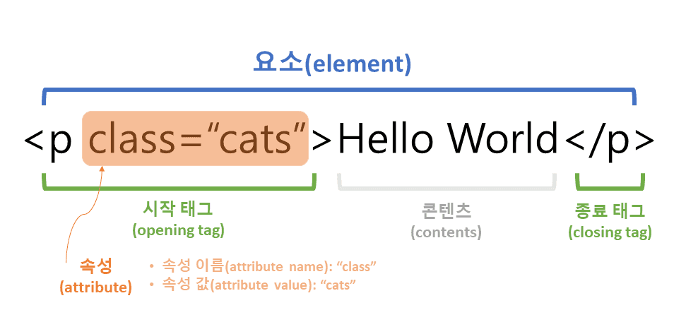

# HTML

---

<link
  rel="stylesheet"
  href="https://cdnjs.cloudflare.com/ajax/libs/codemirror/6.65.7/codemirror.min.css"
/>
<link
  rel="stylesheet"
  href="https://cdnjs.cloudflare.com/ajax/libs/codemirror/6.65.7/theme/material.min.css"
/>

<script src="https://cdnjs.cloudflare.com/ajax/libs/codemirror/6.65.7/codemirror.min.js"></script>
<script
  src="https://cdnjs.cloudflare.com/ajax/libs/codemirror/6.65.7/mode/xml/xml.min.js"
  integrity="sha512-LarNmzVokUmcA7aUDtqZ6oTS+YXmUKzpGdm8DxC46A6AHu+PQiYCUlwEGWidjVYMo/QXZMFMIadZtrkfApYp/g=="
  crossorigin="anonymous"
  referrerpolicy="no-referrer"
></script>

#### 1. HTML

###### 개요

- HTML이란 HyperText Markup Language의 약어로, HyperText 기능을 가지는 문서를 만드는 언어
- HyperText는 웹 페이지에서 다른 페이지로 이동할 수 있는 기능을 의미함

###### 기본 구조



- HTML은 기본적으로 여는 태그 `<tag>`와 닫는 태그`</tag>`가 존재
- 태그 사이에 컨텐츠가 필요 없는 태그들은 `<tag />`와 같은 Self-closing 방식 사용

#### 2. 기본 문법

HTML 문서인 웹 페이지는 **head**영역과 **body**영역으로 이루어짐

###### **head** 영역

- head 영역에는 일반적으로 title, style, link, meta, script등 메타데이터를 정의하는데 사용

      - 메타데이터는 다른 데이터를 설명하는 데이터를 의미함
      - 즉, body영역을 설명하기 위한 데이터가 head영역에 들어있다는 의미

  - title태그

    - title태그는 HTML 문서의 제목을 정의할 때 사용

    ```html
    <title>This is Example Title!</title>
    ```

  - style태그

    - style태그는 HTML 문서의 스타일을 조절할 때 사용
    - 보통 CSS3를 많이 사용함

    ```html
    <style>
      .container {
        background-color: black;
        color: white;
      }
    </style>
    ```

  - link 태그

    - link태그는 해당 문서와 외부 리소스 간의 관계를 저장할 때 사용
    - link태그는 빈 태그 이기 때문에 닫는 태그가 필요하지 않음
    - 다음과 같은 코드를 통해 외부 CSS3 파일을 사용할 수 있음

    ```html
    <link rel="stylesheet" type="text/css" href="./style.css" />
    ```

    - 다음과 같은 코드로 사이트의 아이콘을 변경할 수 있음

    ```html
    <link rel="icon" type="image/png" href="favicon.ico" sizes="16x16" />
    ```

  - meta 태그

    - meta태그는 해당 문서에 대한 정보인 메타데이터를 정의
    - 검색 엔진을 위한 키워드를 정의하는 예제

    ```html
    <meta name="keyword" content="HTML, meta, tag, element, reference" />
    ```

    - 웹 페이지에 대한 설명을 정의하는 예제

    ```html
    <meta name="description" content="This is example description!" />
    ```

    - 문서의 저자를 정의하는 예제

    ```html
    <meta name="author" content="SuperCodingTeam" />
    ```

    - 3초 뒤에 다른 페이지로 리다이렉트시키는 예제

    ```html
    <meta http-equiv="refresh" content="3;url=https://www.naver.com" />
    ```

    - 모든 장치에서 웹 사이트가 잘 보이도록 뷰포트를 설정하는 예제

    ```html
    <meta name="viewport" content="width=device-width, initial-scale=1.0" />
    ```

  - script 태그

    - script태그는 자바스크립트를 사용하기 위해 사용
    - 다음과 같은 코드를 통해 자바스크립트를 사용할 수 있음

    ```html
    <script>
      const button = document.querySelecotr("button.btn");
      button.innerText = "click me";
    </script>
    ```

    - 다음과 같은 코드를 통해 외부 자바스크립트와 연결할 수 있음

    ```html
    <script src="your javascript path"></script>
    ```

###### **body** 영역

- body 영역은 HTML에서 핵심적인 부분
- HTML 문서의 텍스트, 하이퍼링크, 이미지, 리스트 등과 같은 모든 콘텐츠를 포함하는 영역

#### 3. 텍스트 요소

###### 제목

- HTML은 제목을 표현할 수 있는 다양한 크기의 `<h>`태그를 제공
- 가장 큰 `<h1>`태그부터 가장 작은 `<h6>`태그 까지 다양한 크기로 제목 표현

- 코드 실행
<textarea placeholder="Enter HTML Source Code" class="code">
<h1>제목1의 크기입니다!</h1>
<h2>제목2의 크기입니다!</h2>
<h3>제목3의 크기입니다!</h3>
<h4>제목4의 크기입니다!</h4>
<h5>제목5의 크기입니다!</h5>
<h6>제목6의 크기입니다!</h6>
</textarea>
<button class="btn">실행</button>
<iframe class="frame"></iframe>

###### 단락

- HTML에서는 `<p>`태그를 이용하여 이러한 단락을 표현
  > `<p>`태그의 위아래로는 약간의 여백(margin)이 자동으로 삽입됨

<textarea placeholder="Enter HTML Source Code" class="code">
<p>엄청난 단락입니다!</p>
<p>엄청난 두번째 단락입니다!</p>
</textarea>
<button class="btn">실행</button>
<iframe class="frame"></iframe>

###### div 태그

- HTML 문서에서 특정 영역(division)을 정의할 때 사용
- p 태그와는 차지하는 영역이 다름
- 보통 div 태그를 더 자주 사용

<textarea placeholder="Enter HTML Source Code" class="code">
<div>
  Hello I'm <span style="color: blue">span</span>
  <span style="color: red">tag</span>
</div>
</textarea>
<button class="btn">실행</button>
<iframe class="frame"></iframe>

###### span 태그

- HTML 문서에서 인라인 요소(inline-element)들을 하나로 묶을 때 사용
- div와 굉장히 흡사하지만, div는 블록 요소, span은 인라인 요소

<textarea placeholder="Enter HTML Source Code" class="code">
<div>안녕하세요 Div입니다.</div>
</textarea>
<button class="btn">실행</button>
<iframe class="frame"></iframe>

###### 하이퍼링크

- HTML에서는 `<a>` 태그를 이용하여 하나의 페이지에서 다른 페이지를 연결할 때 사용하는 하이퍼링크를 표현

<textarea placeholder="Enter HTML Source Code" class="code">
<p><a href="../../">링크</a>를 클릭하여 이동하세요!</p>
</textarea>
<button class="btn">실행</button>
<iframe class="frame"></iframe>

###### 폰트 효과

- b(bold), i(italics), small, big, u(underline), del(deleted) 태그등 다양한 태그 존재

<textarea placeholder="Enter HTML Source Code" class="code">
<b>This is b tag</b>
<br />
<i>This is i tag</i>
<br />
<small>This is small tag</small>
<br />
<big>This is big tag</big>
<br />
<u>This is u tag</u>
<br />
<del>This is del tag</del>
<br />
</textarea>
<button class="btn">실행</button>
<iframe class="frame"></iframe>

###### 주석

- 주석(comment)이란, 개발자가 작성한 해당 코드에 대한 이해를 돕는 설명이나 디버깅을 위해 작성한 구문
- HTML에서는 주석을 `<!-- 주석 내용 -->` 과 같이 표현함

<textarea placeholder="Enter HTML Source Code" class="code">
<!-- 이부분은 주석이라 웹 페이지에 나오지 않아요 -->
<!-- 엄청 대단하지 않나요 -->

<!-- 이 버튼을 클릭시 경고문이 나옵니다. -->

<button onclick="alert('경고문')">클릭</button>
</textarea>
<button class="btn">실행</button>

<iframe class="frame"></iframe>

#### 4. HTML 기본 요소

###### 스타일

- HTML 요소의 style속성(attribute)를 이용하면 CSS 스타일을 HTML 요소에 직접 설정 가능

<textarea placeholder="Enter HTML Source Code" class="code">
<h1 style="color: red">style 속성을 이용한 글자색 변경</h1>
<h1 style="background-color: aqua">style 속성을 이용한 배경색 변경</h1>
</textarea>
<button class="btn">실행</button>
<iframe class="frame"></iframe>

###### 링크

- 하이퍼 링크라고도 하며, HTML에서는 `<a>`태그로 표현
- href 속성은 링크를 클릭하면 연결할 페이지나 사이트의 URL 주소를 명시
- target 속성을 통해 문서를 어디에서 열지 명시 가능

  | target 속성값 | 설명                                                            |
  | ------------- | --------------------------------------------------------------- |
  | \_blank       | 링크로 연결된 문서를 새 창이나 새 탭에서 오픈                   |
  | \_self        | 링크로 연결된 문서를 현재 프레임(frame)에서 오픈 (기본설정)     |
  | \_parent      | 링크로 연결된 문서를 부모 프레임(frame)에서 오픈                |
  | \_top         | 링크로 연결된 문서를 현재 창의 가장 상위 프레임(frame)에서 오픈 |
  | 프레임(frame) | 이름 링크로 연결된 문서를 지정된 프레임(frame)에서 오픈         |

<textarea placeholder="Enter HTML Source Code" class="code">
<h2><a href="/" target="_blank">blank</a></h2>
<h2><a href="/" target="_self">self</a></h2>
<h2><a href="/" target="_parent">parent</a></h2>
<h2><a href="/" target="_top">top</a></h2>
<h2><a href="/" target="myframe">myframe</a></h2>
<iframe name="myframe" style="width:50%; height: 330px"></iframe>
</textarea>
<button class="btn">실행</button>
<iframe class="frame"></iframe>

###### 이미지

- HTML 문서에 이미지를 삽입할 때는 ``태그를 사용
- src 속성을 통해 경로를, alt속성을 통해 이미지 대신 나타날 문자열 설정 가능

<textarea placeholder="Enter HTML Source Code" class="code">

<!-- 만약 이미지 경로가 잘못돼 이미지가 보이지 않는 경우 -->

<iframe name="myframe" style="width:50%; height: 330px"></iframe>
</textarea>
<button class="btn">실행</button>
<iframe class="frame"></iframe>

#### 5. HTML 입력 요소

###### Form 태그

- `<form>` 태그를 사용하여 사용자로부터 입력을 받을 수 있음
- 사용자가 입력한 데이터를 서버로 보낼 때에도 form 요소를 사용
- action 속성은 입력받은 데이터를 처리할 서버 상의 스크립트 파일의 주소를 명시(폼 핸들러)
- method 속성은 입력받은 데이터를 서버에 전달할 방식을 명시

<textarea placeholder="Enter HTML Source Code" class="code">
<form action="/" method="post">
  <input type="text" name="name" />
  <br />
  <input type="password" name="password" />
  <br />
  <input type="submit" value="Submit" />
  <input type="reset" value="Reset" />
</form>
</textarea>
<button class="btn">실행</button>
<iframe class="frame"></iframe>

###### Input 태그

- `<input>` 태그를 사용하여 사용자로부터 입력을 받을 수 있음
- type 속성이 굉장히 많음

<textarea placeholder="Enter HTML Source Code" class="code">
text 타입 <input type="text">
<br />
password 타입 <input type="password">
<br />
number 타입 <input type="number">
<br />
radio 타입 <input type="radio">
<br />
checkbox 타입 <input type="checkbox">
<br />
file 타입 <input type="file">
<br />
textarea 타입 <input type="textarea">
<br />
button 타입 <input type="button" value="버튼">
<br />
submit 타입 <input type="submit">
<br />
fieldset 타입 <input type="fieldset">
<br />
date 타입 <input type="date">
<br />
color 타입 <input type="color">
</textarea>
<button class="btn">실행</button>

<iframe class="frame"></iframe>

###### Button 태그

- 클릭할 수 있는 버튼을 정의할 때 사용
- javascript의 eventListener와 동일한 속성이 존재

<textarea placeholder="Enter HTML Source Code" class="code">
<button type="button">클릭</button>
<br />
<button type="button" onclick="alert('good jobs')">
자바스크립트 버튼
</button>
</textarea>
<button class="btn">실행</button>

<iframe class="frame"></iframe>

#### 6. 블록태그 vs 인라인태그

HTML에 존재하는 모든 태그는 블록속성 또는 인라인속성을 가짐

###### 인라인 태그(Inline Tag)

- 내용물의 크기가 태그의 영역이 됨
- 대표적인 인라인 태그로 span, button, input 등이 있음

###### 블록 태그(Block Tag)

- 내용물의 크기와 상관없이 너비는 항상 100%, 높이는 내용물의 크기에 맞춰 변화
- 대표적인 블록 태그로 div, form, h1~h6 등이 있음

<textarea placeholder="Enter HTML Source Code" class="code">
<head>
  <style>
    div {
      background-color: lightpink;
    }
    span {
      background-color: lightblue;
    }
  </style>
</head>
<body>
  <div>Hello I'm block tag!</div>
  <div>
    Lorem Ipsum is simply dummy text of the printing and typesetting industry.
  </div>
  <span>Hello I'm inline tag!</span>
  <span>
    Lorem Ipsum has been the industry's standard dummy text ever since the
    1500s
  </span>
</body>
</textarea>
<button class="btn">실행</button>

<iframe class="frame"></iframe>

#### 7. HTML 시맨틱 태그

- 시맨틱 태그는 태그 내용에 의미를 부여하는 태그
- 웹 페이지에 보이는 것 이상의 정보를 제공
- article, aside, details, figcaption, figure, footer, header, main, mark, nav, section, summary, time 태그 모두 시맨틱 태그
- 자주 사용하는 시맨틱 태그는 header, nav, main, footer 정도

###### header 태그

- 문서나 섹션의 머릿글을 지정하며, 로고, 탐색, 제목 및 기타 소개 정보가 포함된 페이지 상단 부분을 정의

###### nav 태그

- 웹사이트의 메뉴, 탭, 탐색경로 등 탐색 링크가 포함된 페이지 부분을 정의

###### main 태그

- 문서나 섹션의 머릿글을 지정하며, 로고, 탐색, 제목 및 기타 소개 정보가 포함된 페이지 상단 부분을 정의

###### footer 태그

- 문서 또는 섹션의 바닥글을 지정하며, 문서의 아래쪽에 위치

#### 8. Emmet

- Visual Studio Code에서는 Emmet이 내장되어 있음
- Emmet 단축키를 통해 빠르게 HTML 코드를 작성할 수 있음
- <a href="https://www.hanl.tech/blog/emmet-%EB%8B%A8%EC%B6%95%ED%82%A4-%EB%B0%8F-%ED%8A%B8%EB%A6%AD-9%EA%B0%80%EC%A7%80/">링크</a>를 클릭하여 확인

<script>
const codes = document.querySelectorAll("textarea.code");
const buttons = document.querySelectorAll("button.btn");
const frames = document.querySelectorAll("iframe.frame");
var editors = []

codes.forEach((element, index) => {
editors.push(CodeMirror.fromTextArea(element, {
matchBrackets: true,
lineWrapping: true,
styleActiveLine: true,
mode: 'xml',
lineNumbers: true,  
 theme: 'material',
tabSize: 2
}));

buttons[index].addEventListener("click", () => {
const code = editors[index].getValue();
frames[index].srcdoc = code;
});
});

</script>
