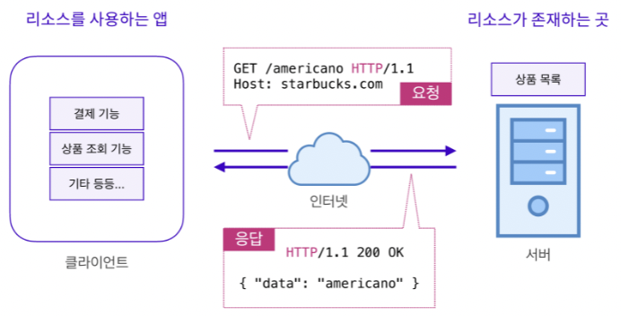

# 클라이언트 - 서버 구조

### 클라이언트와 서버의 개념

- #### 클라이언트

  - 클라이언트는 고객, 의뢰인이라는 의미
  - 개발자들은 서버에 요청을 보내는 고객을 클라이언트라고 부름
  - 예시) 카페에서 음료를 주문하는 손님 = 클라이언트

- #### 서버

  - 서버는 클라이언트에게 네트워크를 통해 정보나 서비스를 제공하는 컴퓨터 시스템
  - 예시) 카페에서 음료 주문을 받고, 음료를 제작 후 제공하는 바리스타 = 서버

- #### 클라이언트 - 서버의 흐름

  

  - 클라이언트와 서버는 다음과 같은 흐름으로 리소스(데이터)를 교환
  - 클라이언트에서 필요한 리소스를 서버에 요청
  - 서버는 클라이언트의 요청을 받고 리소스를 제공

- #### 클라이언트와 서버 존재 이유

  - 클라이언트와 서버는 분리되는 것이 일반적
  - 중요한 데이터 정보가 소스코드에 담겨 있어 소스코드를 읽는 것 만으로 정보 조회 가능
  - 예시) 코카콜라가 편의점에서 생성하여 제공한다면, 생성 과정을 볼 수 있다면 레시피 유추 가능

- #### CORS 정책
  - CORS(Cross Origin Resource Sharing) 정책은 출처가 다른 클라이언트로 부터 어떠한 데이터를 공유 하지 않음을 규정
  - CORS 정책은 서버 Middleware 에서 Access-Control-Allow-Origin헤더를 설정 가능
  - Access-Control-Allow-Origin 헤더가 "\*" 이면 모든 IP(출처)로 부터 데이터를 공유할 수 있음
